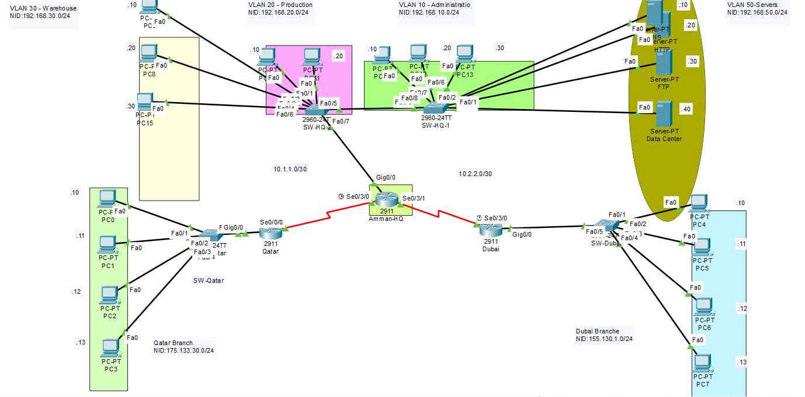

# NeuroGrid Dynamics: Secure Corporate Network Architecture

## 📌 Project Overview
As a Junior Network Security Engineer, I designed and implemented a secure, scalable, and highly available network infrastructure for NeuroGrid Dynamics, an innovative technology company specializing in smart infrastructure and IoT-driven energy optimization solutions.

This project was developed to ensure the Confidentiality, Integrity, and Availability (CIA) of all corporate and operational data across the headquarters in Amman, Jordan, and regional branches in the Gulf (Dubai, Riyadh, and Doha), The infrastructure heavily emphasizes network segmentation, secure remote connectivity, and strict access controls.

---

## 🗺️ Network Topology

---

## 🏢 Business Scenario & Requirements
NeuroGrid Dynamics recently underwent an internal security audit that identified vulnerabilities such as weak access controls, a lack of network segmentation, and insecure communication channels. 

To address these critical flaws, I engineered a comprehensive network redesign that ensures:
* Secure interconnections between the Gulf offices and the Amman headquarters
* Strictly controlled and monitored access to the central data center, which is logically separated into a dedicated subnet.
* Secure employee access to the internal Smart Operations Portal (SOP) via its Fully Qualified Domain Name (FQDN).

---

## ⚙️ Key Security Implementations

I utilized Cisco Packet Tracer to simulate, validate, and test the following security mechanisms[cite: 97, 98]:

* **Network Segmentation (VLANs):** Logically isolated traffic using VLANs (VLAN 10 for Administration, VLAN 20 for Production, VLAN 30 for Warehouse, and VLAN 50 for the Data Center) with secure 802.1Q trunk links.
* **IPsec Site-to-Site VPN:** Configured secure, encrypted VPN tunnels between the Qatar and Dubai branches to protect data traversing public networks.
* **Access Control Lists (ACLs):** Deployed Standard and Extended ACLs to enforce granular traffic filtering and restrict unauthorized access to critical servers.
* **Identity & Access Management:** Integrated an AAA (Authentication, Authorization, and Accounting) server for centralized administrative access control.
* **Layer 2 Security:** Hardened the infrastructure by implementing switch port security features and configuring robust passwords on all routers and switches.
* **Secure Network Services:** Secured internal communications by enforcing HTTPS for web traffic, alongside properly configured DNS and DHCP services.

---

## 🧪 Testing & Validation
Following the design and configuration phase, I developed and executed a comprehensive test plan to evaluate the network's resilience. 

My testing methodology included:
* Verifying end-to-end connectivity across all segmented VLANs and remote branches.
* Validating the IPsec VPN tunnel encapsulation between regional sites.
* Auditing ACL rules to confirm that unauthorized subnet traffic is successfully dropped.
* Testing AAA authentication to ensure proper administrative logging and access denial for unverified users.

---

## 🛠️ Tools & Technologies
**Simulation Environment:** Cisco Packet Tracer (v9.0+) 
**Routing & Switching:** OSPF, 802.1Q Trunking, Inter-VLAN Routing
**Security Protocols:** IPsec, AAA (RADIUS/TACACS+), ACLs, Port Security
**Services:** HTTP/HTTPS, DNS, DHCP, FTP 
